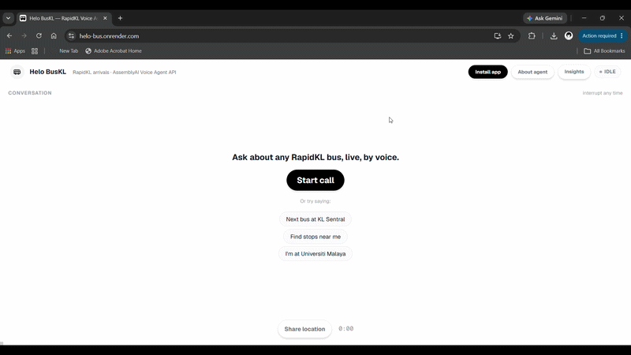
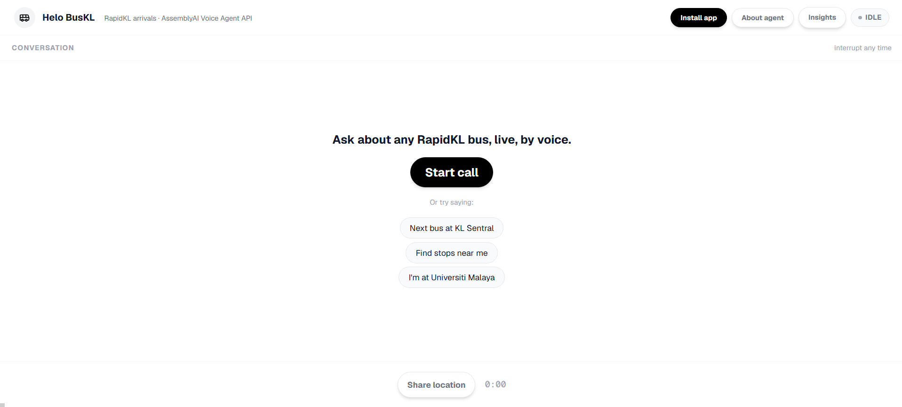
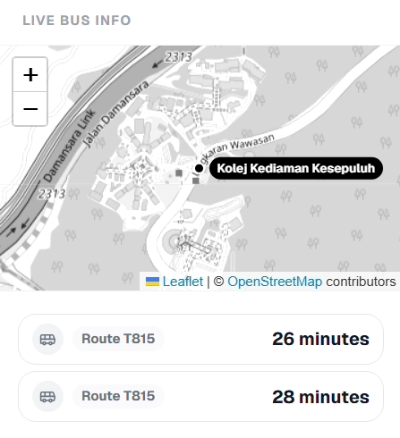
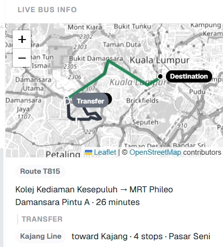
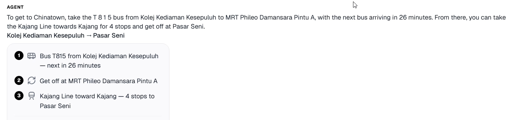
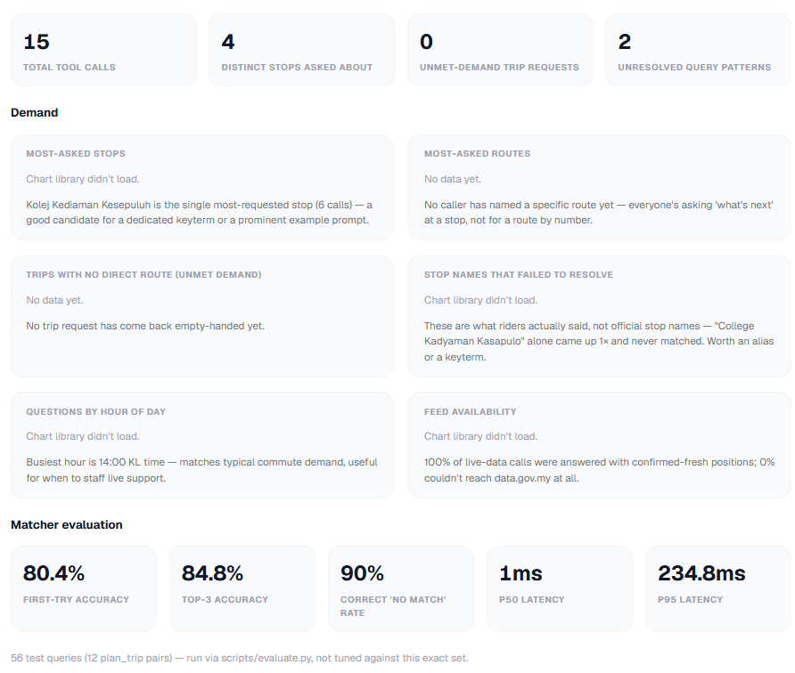
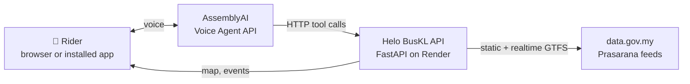

# 🚌 Helo BusKL

**Ask your bus. Out loud.**

A voice agent for Klang Valley bus and rail riders. Say where you are and where you're going, and it answers with **live RapidKL data**: when your bus arrives, how to get there by bus and MRT/LRT, and a heads-up when your bus is close.

Built for the **AssemblyAI Voice Agent Hackathon** on lablab.ai, on the AssemblyAI Voice Agent API.

**[▶ Try it live](https://helo-bus.onrender.com)** · **[🎬 Demo video](https://drive.google.com/file/d/11kKCte88SHISUo2arH0xdq8UUCFx9WAP/view?usp=sharing)** · **[📑 Slides](https://docs.google.com/presentation/d/1d9NM4QPMMAbF4ApRoRQRwWyEkKBvm2wO/edit?usp=drive_link&ouid=105361652674372398038&rtpof=true&sd=true)**



---

## The problem

Prasarana carried an average of **1.31 million passengers a day in 2025**, but the tools for using buses assume a lot:

- **You need the official stop name.** Stops are named in Malay, by platform and gate ("Pasar Seni (Platform B5)"). Riders say "Chinatown", "UM" or "KL Central".
- **Map apps assume you can read, tap and type.** That's hard for elderly and visually impaired riders, and for anyone with their hands full at a bus stop.
- **Waiting blind is normal.** The Klang Valley has roughly one bus per 5,000 passengers, so knowing when yours comes matters.

## What Helo BusKL does

You talk to it like a friend who knows every bus in KL.

| | |
|---|---|
| 🕐 **Live arrivals** | Minutes until the next bus, computed from real-time GPS positions |
| 📍 **Finds your stop** | By official name, English version, landmark, nickname, or your location |
| 🗺️ **Plans the trip** | Bus + MRT/LRT/Monorail, with a line change and short walks, drawn on a live map |
| 🔔 **Alerts you** | "Tell me when it's 5 minutes away", so you can stop checking |
| 📊 **Helps the operator** | Every question becomes demand data on the Insights page |

A real conversation:

> **You:** I'm at Kolej Kediaman Kesepuluh. When's my bus?
> **Helo BusKL:** The T815 is arriving in 8 minutes. Want me to tell you when it's 5 minutes away?
> **You:** How do I get from KL Sentral to Pasar Seni?
> **Helo BusKL:** Take the Kelana Jaya Line toward Gombak, just one stop to Pasar Seni.

## Try it

1. Open **[helo-bus.onrender.com](https://helo-bus.onrender.com)** in Chrome, Edge or Safari (or install it to your phone's home screen).
2. Tap **Share location**, then **Start call**, and allow the microphone.
3. Try one of these:
   - "When's the next bus at KL Sentral?"
   - "Find stops near me."
   - "How do I get from Universiti Malaya to Pasar Seni?"
   - "I'm near Chinatown. What's coming?"

RapidKL buses run from about 6 AM to 11 PM Malaysia time (UTC+8). Outside those hours the agent will tell you service isn't running, because there's no live data.

## Screenshots

| Start screen | Live arrivals | Trip planned on the map |
|---|---|---|
|  |  |  |

| Trip, step by step | Installable app | Demand insights |
|---|---|---|
|  |  |  |

## How it works



The browser streams the rider's voice straight to AssemblyAI. When the agent needs facts, **AssemblyAI calls the Helo BusKL API directly over HTTP**, and the API reads Prasarana's public GTFS data from data.gov.my. There is no tool dispatcher and no server-side WebSocket: the agent is a stored JSON config, and the API only answers plain HTTP.

### How AssemblyAI is used

| Feature | How Helo BusKL uses it |
|---|---|
| **Stored agent** (`/v1/agents`) | The whole agent (prompt, voice, keyterms, tools) lives in `agent.json`, published once with `scripts/create_agent.py` |
| **HTTP tools** | Six tools called server-to-server by AssemblyAI, so the rider's browser never runs tool logic |
| **Keyterm boosting** | The most important stop names and route codes, ranked from the GTFS data by `scripts/build_keyterms.py` |
| **Streaming speech-to-text + voice** | Natural conversation, with interruptions ("barge-in") at any time |
| **Short-lived tokens** | The server mints a 5-minute token; the API key never reaches the browser |

### The six tools

| Tool | What it does |
|---|---|
| `find_stop` | Turns a spoken name, English version, landmark or mishearing into a real stop or station, or offers the closest matches |
| `find_nearby_stops` | The closest stops to the rider's shared location, with walking distance |
| `next_arrivals` | Live ETAs for every route serving a stop |
| `plan_trip` | Bus and rail journeys with a line change and short walks, including the live time for bus legs |
| `set_arrival_alert` | Alerts the rider when a bus is within N minutes |
| `get_now` | The current time in Kuala Lumpur (the model has no clock) |

Every tool answers with an `ok` flag and a `message` written to be **spoken aloud**. Failures carry a way forward: an ambiguous name comes back with candidates, and an unknown one triggers a nearby-stops suggestion, so the agent recovers inside the conversation instead of apologising.

## Hard problems we solved

**Malay place names get misheard.** Speech-to-text turned "Kolej Kediaman" and "Muzium Negara" into nonsense. Helo BusKL adds a local language layer: boosted keyterms, a landmark alias list ("Chinatown" → Pasar Seni, "UM" → Universiti Malaya), English-to-Malay rules ("KL Central" → KL Sentral, "Faculty of Computer Science" → Fakulti Sains Komputer), sound-alike matching, and a fallback to stops near the rider when a name still fails.

**The live feed has no arrival times.** data.gov.my publishes only bus GPS positions. Helo BusKL computes ETAs from each bus's distance along its route, filters out buses that have already passed, and handles loop routes like the T815 that visit the same stop twice.

**Real KL journeys need interchanges.** Rail is modelled as a graph of lines, interchanges and walkways, so a trip can combine a bus, a train, a line change and a short walk (for example, Muzium Negara MRT to KL Sentral by walkway).

**Two callers can't see each other's data.** Map state, tool-call events and shared location used to sit in one global slot, so any browser polling the demo page could in principle see another caller's trip. Every call now gets its own id at the moment it starts, and every read (`/api/map-state`, `/api/events`, `/api/location`) is scoped to that id — a fresh page load or a stale tab never sees a trip that isn't theirs.

**A 512 MB free server.** GTFS data is precomputed into one compact file. Live feeds are fetched in parallel with 3-second timeouts, and cached data is used rather than making a tool call wait, so the agent never hangs on a slow feed.

## Measured results

| Metric | Result |
|---|---|
| Right stop suggested first | **80%** of 56 test queries |
| Right stop in the top 3 suggestions | **85%** |
| Correctly finds no match for nonsense queries | **90%** |
| Median response time (20 live calls on the deployed server) | **0.5 s** |
| Slowest trip plan (bus + rail search) | **2.0 s** |

The 56 queries include exact names, English versions, landmarks, **14 speech-to-text mishearings**, and 10 queries that shouldn't match anything. Run them yourself with `python scripts/evaluate.py`. The test set grew alongside the app, so treat it as a regression suite, not an independent benchmark.

## Why not just use a map app?

| | Typical map app | Helo BusKL |
|---|---|---|
| How you ask | Read, tap and type | Just speak; interrupt any time |
| Stop names | Official names only | "UM", "Chinatown", "KL Central", misheard Malay |
| When it can't find it | You search again | Offers the stops near you |
| While you wait | You keep checking | Tells you when the bus is 5 minutes away |
| For the operator | Nothing | Demand insights from every question |

Map apps are built for people who can use map apps. Helo BusKL is for everyone else.

## Business value

Every question a rider asks is demand data. The **Insights** page (`/insights`) shows what an operator like Prasarana can't easily see today:

- the most-asked stops and routes
- trips riders want that have **no direct route**, which are candidates for new feeder services
- what riders actually call places, compared with official names
- live feed health across the network

Possible revenue: an **operator licence** (an accessibility channel plus demand insights), a **phone hotline** using the same agent over SIP for riders without smartphones, and **other cities**, since it works on any open GTFS feed.

## Roadmap

- **Now:** live arrivals, stop finding by voice, landmark or GPS, bus + rail trip planning, arrival alerts, installable app, demand insights
- **Next:** Bahasa Melayu and Chinese conversations, a phone hotline, rail arrival times when a live rail feed exists
- **Later:** a pilot with an operator, more cities, a native app

## Known limitations

- **No live rail arrival times.** There's no realtime rail feed, so rail legs give the line, direction and number of stops.
- **No fares.** There's no official fare data in the feeds, so the agent points riders to the myRapid app instead of guessing.
- **At most one rail line change** per trip.
- **iOS may end a call if the phone is locked** mid-conversation; keep the screen on during a call.
- **Only one call is "active" at a time server-side.** Tool-call events are attributed to whichever call started most recently (AssemblyAI's tool calls carry no session id of their own — see "Hard problems we solved"), so two genuinely simultaneous callers could see each other's live events. Fine for a demo; a production version needs AssemblyAI to pass a session id through to the tool call itself.
- **Free hosting** can take a moment to wake up if the site hasn't been used recently.

## Run it yourself

```bash
python -m venv .venv
.venv\Scripts\activate            # macOS/Linux: source .venv/bin/activate
pip install -r requirements.txt
uvicorn app.main:app --reload     # http://localhost:8000
```

GTFS data is precomputed in `data/static.json`, so a fresh clone runs immediately. Refresh it with `python scripts/build_static.py`.

AssemblyAI calls your tools from its own servers, so they need a **public HTTPS URL**:

1. Deploy to Render (or Railway/Fly) with build command `pip install -r requirements.txt` and start command `uvicorn app.main:app --host 0.0.0.0 --port $PORT`, and set `ASSEMBLYAI_API_KEY` in the environment. For local testing, `cloudflared tunnel --url http://localhost:8000` also works.
2. Copy `.env.example` to `.env` and set `ASSEMBLYAI_API_KEY` and `PUBLIC_API_BASE_URL`.
3. Publish the agent with `python scripts/create_agent.py` (after changes: `--update <agent_id>`).

Run the tests with `pytest`.

## Project layout

| Path | What it is |
|---|---|
| `agent.json` | The whole agent: prompt, voice, keyterms, six HTTP tools |
| `app/main.py` | The API AssemblyAI calls, plus token, events, map and insights endpoints |
| `app/gtfs.py` | Stop search, ETA computation, trip planning, live feed handling |
| `app/store.py` | The per-call event log, arrival alerts, and which call is currently active |
| `app/mapstate.py` | Geometry for the live map, derived from each tool result and scoped to its call |
| `app/insights.py` | Durable (SQLite) analytics log behind the `/insights` page |
| `data/static.json` | Precomputed stops, routes, rail network and distances |
| `data/aliases.json` | Landmarks and nicknames mapped to real stops |
| `data/eval_queries.json` | The evaluation set used by `scripts/evaluate.py` |
| `scripts/` | Publish the agent, build static data and keyterms, run the evaluation |
| `web/` | The app: voice call, live map, trip cards, installable PWA, insights page |
| `tests/` | Automated regression tests |

## Credits

- Built on the **[AssemblyAI Voice Agent API](https://www.assemblyai.com/)**.
- Data: Prasarana GTFS static and realtime feeds via **[data.gov.my](https://developer.data.gov.my/)**.
- Scaffold from **[vicdevman/assemblyai-voice-agent-scheduler](https://github.com/vicdevman/assemblyai-voice-agent-scheduler)**, the reference implementation for AssemblyAI's HTTP-tools tutorial.
- ETA approach adapted from **where-bus** (a team project), reimplemented independently in Python. where-bus is not called at runtime.
- Maps © OpenStreetMap contributors, rendered with Leaflet.

## Licence

MIT. See [LICENSE](LICENSE).

Made by **Tan Wen Jie** ([@mosquito-canfly](https://github.com/mosquito-canfly)), Universiti Malaya.
